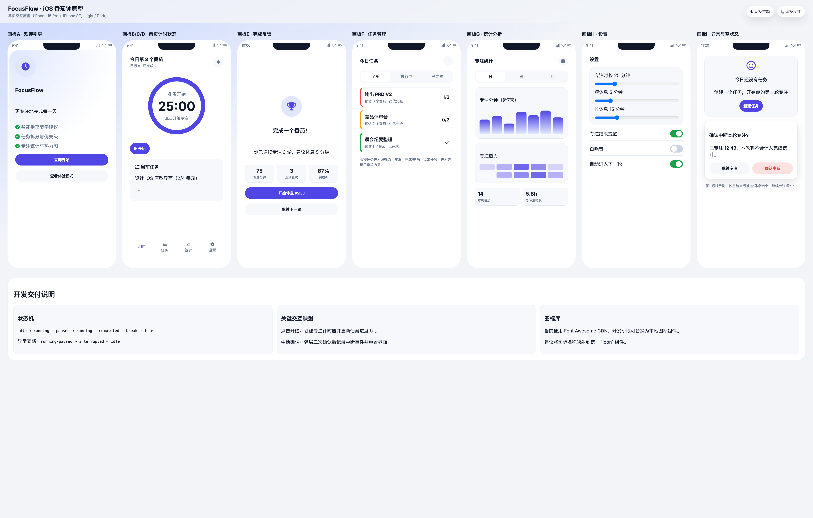
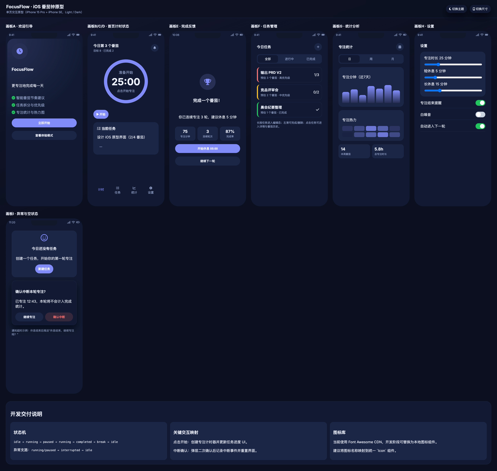

# FocusFlow - 专注番茄钟

一个基于 SwiftUI 构建的 iOS 番茄工作法应用，帮助你更专注地完成每一天。






## 功能特性

### 番茄计时器
- 自定义专注时长（15-60 分钟）
- 短休息（3-10 分钟）和长休息（10-30 分钟）设置
- 直观的圆形进度条显示
- 中断确认提醒
- 专注完成统计气泡展示

### 任务管理
- 创建、删除任务
- 任务标签分类（工作、学习、设计、生活）
- 任务目标番茄数设定
- 滑动删除和点击完成
- 任务过滤筛选（全部/进行中/已完成）

### 专注统计
- 近 7 天柱状图展示
- 专注热力图
- 本周番茄数统计
- 总专注时长统计

### 设置
- 专注时长调整
- 休息时长配置
- 专注结束提醒开关
- 白噪音开关
- 自动进入下一轮开关

### 其他
- 首次使用引导页
- 数据本地持久化（UserDefaults）

## 技术栈

- **UI 框架**: SwiftUI
- **架构**: MVVM（FocusStore 作为状态管理中心）
- **数据存储**: UserDefaults + Codable
- **目标平台**: iOS 17+
- **最低版本**: iOS 17.0

## 项目结构

```
pomodoro/
├── pomodoroApp.swift          # 应用入口
├── ContentView.swift          # 主视图（含所有 UI 组件和数据模型）
└── Assets.xcassets/           # 资源目录
    ├── AccentColor.colorset   # 主题色
    └── AppIcon.appiconset      # 应用图标
```

## 运行

1. 使用 Xcode 打开 `pomodoro.xcodeproj`
2. 选择模拟器或真机
3. 按 `Cmd + R` 运行

## 主要视图

| 视图 | 描述 |
|------|------|
| `OnboardingView` | 首次引导页 |
| `TimerTab` | 番茄计时器 |
| `TasksTab` | 任务管理 |
| `StatsTab` | 专注统计 |
| `SettingsTab` | 设置页 |

## 数据模型

- **FocusTask**: 任务结构体
- **FocusTag**: 任务标签枚举
- **FocusStore**: 全局状态管理器
- **FocusPersistState**: 持久化数据结构
